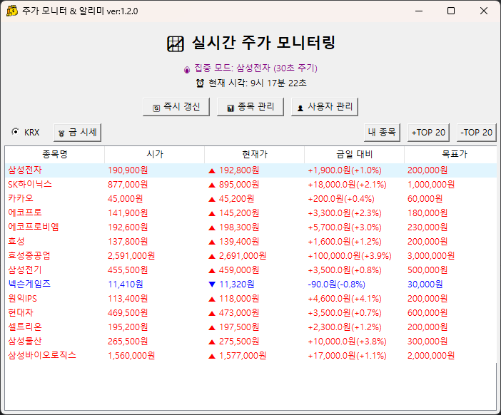
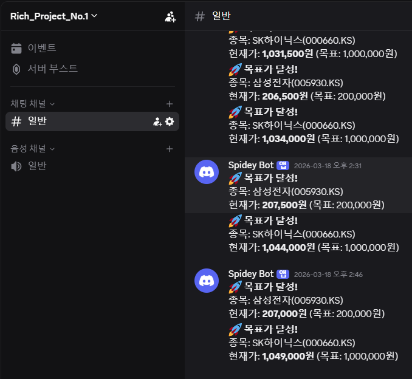
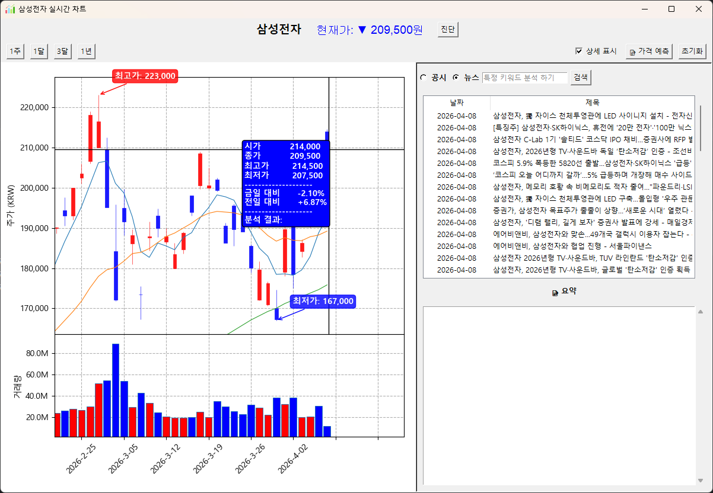
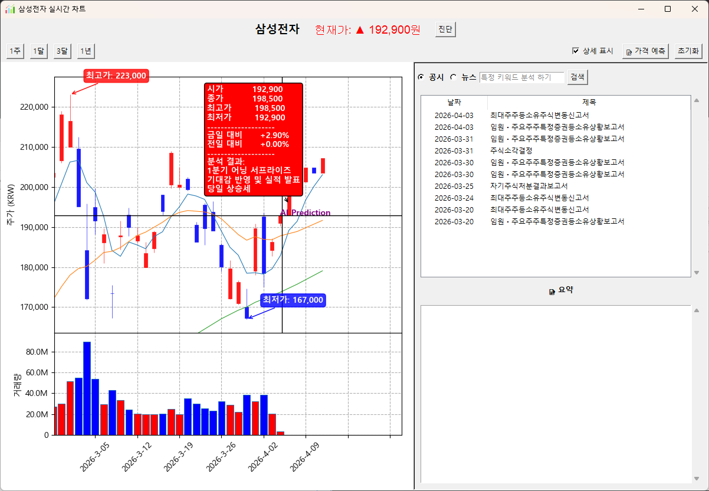
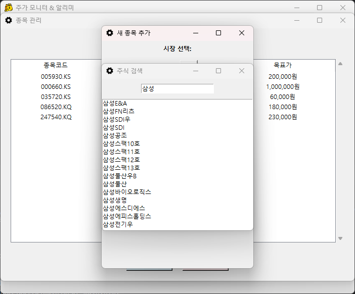

# RICH 프로젝트
RICH 프로젝트는 투자자가 설정한 목표가 달성 시 실시간 Discord 알림을 제공하며, 딥러닝 모델과 생성형 AI(Gemini)를 활용하여 주가 데이터를 분석하는 PC프로그램 입니다.

이 프로젝트는 mplfinance를 활용한 전문적인 캔들 차트 시각화와 더불어, 과거 데이터를 학습한 AI의 가격 예측 및 최신 DART 공시 요약 기능을 제공하여 투자 의사결정을 돕습니다.

## 🚀 주요 기능
### 1. 스마트 알림 시스템 (Discord Webhook)
목표가 감시: 관심 종목의 실시간 가격을 모니터링하여 설정한 목표가에 도달하면 즉시 알림을 발송합니다.

Discord 연동: Webhook URL 설정을 통해 별도의 앱 확인 없이도 스마트폰이나 PC의 Discord 채널로 실시간 메시지를 받아볼 수 있습니다.

### 2. 실시간 전문 캔들 차트
인터랙티브 차트: 마우스 휠 줌(Zoom), 드래그 이동(Pan)을 지원하며 구간별 최적의 Y축 범위를 자동 조정합니다.

상세 정보 표시: 마우스 오버 시 시가, 종가, 고가, 저가 및 변동률을 툴팁으로 즉시 확인 가능합니다.

실시간 시세 연동: 일정 주기마다 최신 주가를 받아와 차트를 갱신합니다.

### 3. AI 가격 예측 (LSTM 기반)
기술적 분석: 과거 60일간의 종가와 거래량 데이터를 LSTM 모델이 학습하여 향후 5일간의 주가 흐름을 예측합니다.

시각화: 예측된 미래 가격 데이터를 차트상에 'AI Prediction' 구간으로 표시합니다.

### 4. DART 공시 & AI 뉴스 요약
공시 자동 로딩: Open DART API를 통해 해당 종목의 최신 공시 목록을 실시간으로 가져옵니다.

AI 감성 분석: Gemini AI를 활용하여 선택한 공시의 내용을 분석하고, 호재/악재 여부를 판단하여 핵심 내용을 요약합니다.

### 5. 보안 및 환경 설정
API 키 암호화: 사용자의 API Key(GenAI 등)를 OS 고유 식별자 기반으로 암호화하여 안전하게 관리합니다.

### 6. 종목 관리
증권사 API에 의존하지 않고도 표준화된 데이터를 제공받아, 별도의 복잡한 설치 과정 없이 즉각적인 시세 분석이 가능합니다.

## 🛠 기술 스택 (Tech Stack)
| **분류** | **기술** |
| --- | --- |
| **Language** | Python 3.10+ |
| **GUI** | Tkinter |
| **Analysis** | TensorFlow (Keras), Scikit-learn, Pandas, NumPy |
| **Visualization** | Matplotlib, mplfinance |
| **AI/LLM** | Google Gemini API (Generative AI) |
| **Data** | Open DART API, FinanceDataReader |

---
#### Icons
* **통계 아이콘**: [Freepik - Flaticon](https://www.flaticon.com/kr/free-icons/statistics)
* **설정 아이콘**: [Tempo_doloe - Flaticon](https://www.flaticon.com/kr/free-icons/settings)
* **돈 아이콘**: [Smashicons - Flaticon](https://www.flaticon.com/kr/free-icons/money)

#### Open Source Libraries
* [mplfinance](https://github.com/matplotlib/mplfinance) - 차트 시각화
* [FinanceDataReader](https://github.com/FinanceData/FinanceDataReader) - 금융 데이터 수집
* [Google Generative AI](https://ai.google.dev/) - 공시 분석 및 요약

## 향후 개발 계획
### 글로벌 시장 데이터 커버리지 확대
* NASDAQ, NYSE, S&P 500 등 글로벌 시장의 데이터를 추가.
* 통화/환율 분석: 해외 주식 투자 시 필수적인 환율 변동 추이를 차트에 통합 시각화.

### 모의 투자 지원
사용자가 직접 자신의 투자 가설과 AI 분석 결과를 검증해 볼 수 있는 가상 환경을 구축합니다.
